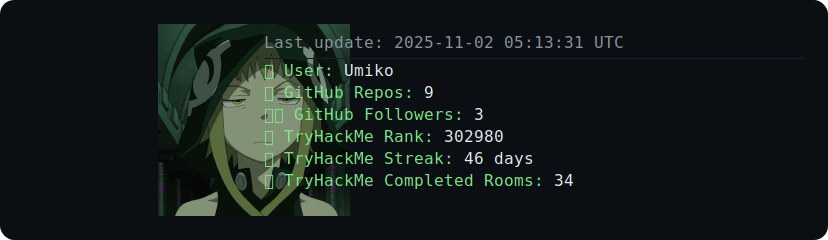

<!-- README-UPDATE-START -->

<!-- README-UPDATE-END -->

Just a dude writing code, playing video games, and hacking systems (ethically).

| GitHub Stats  |
|---------------|
|  |

# Support
I have a few different methods for anyone who wants to support me financially. This is not required, just if you think something I created improved your life, workflow, or anything else!

Ko-fi: https://ko-fi.com/umikoio
<!-- Patreon: Coming soon -->
<!-- GitHub: Coming soon -->

# Contact
I have a few different platforms that I'm available on!

<!-- Discord: Coming soon -->
Email: ping@umiko.io

X (DMs): https://x.com/umiko_io
